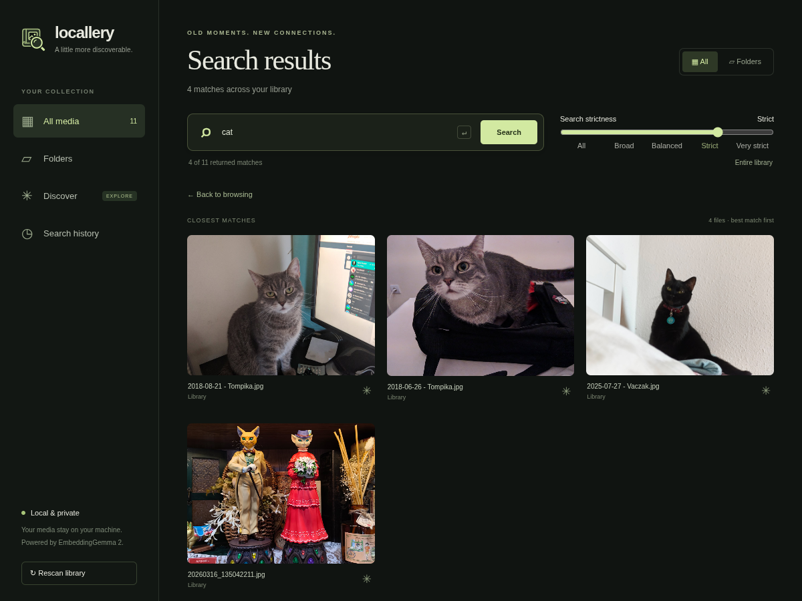

<h1 align="center">
  
  <br />
  Locallery
</h1>

<p align="center">
  <strong>Find the moments you remember, in the photos and videos you already have.</strong>
  <br />
  Search your local library with a few words, find similar images, and rediscover old favorites.
  <br />
  Your media stays on your machine, and your original files stay untouched.
</p>

<p align="center">
  <a href="#getting-started">Get started</a> ·
  <a href="#features">Features</a> ·
  <a href="#configuration">Configuration</a> ·
  <a href="#development">Development</a>
</p>



<p align="center"><sub>A search for “cat” in a sample library, with search strictness set to Strict.</sub></p>

## Features

- **Search in your own words.** Describe what you’re looking for and adjust the strictness to narrow the results.
- **Find more like a favorite.** Choose **Find similar** on an image, then refine your search with text.
- **Rediscover your library.** Explore automatically grouped photos and videos in **Discover**.
- **Keep your folders.** Browse everything together or search a folder and its subfolders.
- **Enjoy photos and videos together.** View images, play videos, and open the original files.
- **Pick up where you left off.** Revisit your latest 50 searches, saved in your browser.
- **Keep it local.** Search runs on your machine using [EmbeddingGemma 2](https://huggingface.co/google/embeddinggemma-2). Your index and previews stay local too.

Locallery scans on startup or when you request a scan, reusing unchanged files and duplicate content. Searches return up to 500 ranked matches; the strictness slider filters those results.

## Getting started

### 1. Install the essentials

Have these tools installed and available on your `PATH`:

| Tool                                                          | What it’s for                                                   |
| ------------------------------------------------------------- | --------------------------------------------------------------- |
| [Bun](https://bun.sh/docs/installation)                       | Runs the app’s launch scripts and builds the gallery.           |
| [uv](https://docs.astral.sh/uv/getting-started/installation/) | Sets up Python and backend dependencies.                        |
| [cjpegli](https://github.com/google/jpegli)                   | Creates image previews.                                         |
| [FFmpeg](https://ffmpeg.org/download.html)                    | Enables video indexing; both `ffmpeg` and `ffprobe` are needed. |

Development and testing use Linux. uv selects Python 3.12.

### 2. Install and launch

From the repository:

```sh
./install.sh
bun run start
```

The installer sets up the dependencies and builds the gallery. It selects a suggested PyTorch build for your machine: CUDA for a detected NVIDIA GPU, or CPU otherwise.

### 3. Choose your library

On first launch, enter your album folder or press Enter to use the current directory. Open [localhost:3000](http://127.0.0.1:3000) to see your library.

The first run downloads the search model if needed. Indexing progress appears in the browser and terminal; browsing and search become available when indexing finishes.

To choose a folder directly:

```sh
bun run start --library /path/to/photos
```

> Locallery is intended for one person on localhost. It has no built-in authentication.

<details>
<summary><strong>CPU and GPU installation options</strong></summary>

The installer prompts for a PyTorch build, defaulting to CUDA when an NVIDIA GPU is detected and CPU otherwise. Without an interactive terminal it uses the detected default. Use `./install.sh --cpu` or `./install.sh --cuda` to choose explicitly or switch an existing installation.

CUDA installs use the CUDA 12.8 PyTorch wheels and need a working NVIDIA driver. The installed environment is reused by start, dev, and benchmark commands; `device: auto` chooses the runtime device.

</details>

<details>
<summary><strong>How your library folder is remembered</strong></summary>

Choosing another folder saves its absolute path in `.locallery/config.yaml`; accepting the current directory does not create a config file. If the working directory already contains `.locallery`, the prompt is skipped: the app uses its configured library, or the current directory. Without an interactive terminal, it defaults to the current directory.

</details>

<details>
<summary><strong>Launch from another directory</strong></summary>

After installing dependencies:

```sh
cd /path/to/photos
/absolute/path/to/locallery/run.sh
```

`run.sh` rebuilds the frontend and starts the backend. To use an existing build:

```sh
/absolute/path/to/locallery/.venv/bin/python -m locallery
```

</details>

## Configuration

Global defaults are created at `~/.locallery/config.yml` on first start. Optional overrides go in `<working-directory>/.locallery/config.yaml`; `config.yml` also works, but `config.yaml` takes precedence. The folder prompt saves only the selected library path; other overrides can be added manually. Restart after changing settings.

For example, to keep using another album folder and skip video indexing:

```yaml
library:
  path: /path/to/photos
video:
  enabled: false
```

`--library` overrides `library.path` for that run without changing the config. Relative library paths resolve against the working directory. Data always goes in `<working-directory>/.locallery/data`, even when the album is elsewhere. `LOCALLERY_HOME` overrides the global config directory.

<details>
<summary><strong>Default settings</strong></summary>

```yaml
server:
  host: 127.0.0.1
  port: 3000
embedding:
  model: google/embeddinggemma-2
  device: auto
  dtype: auto
  cache_dir: null
  batch_size: auto
indexing:
  preparation_workers: 2
video:
  enabled: true
  fps: 1
  max_frames: 32
  overflow_strategy: uniform
  add_timestamps: true
```

</details>

<details>
<summary><strong>Advanced model and indexing settings</strong></summary>

| Setting                        | Behavior                                                                                                                                                                                             |
| ------------------------------ | ---------------------------------------------------------------------------------------------------------------------------------------------------------------------------------------------------- |
| `embedding.model`              | Hugging Face model ID or a local EmbeddingGemma 2 checkpoint directory. Explicit relative paths such as `./checkpoint` resolve against the working directory.                                        |
| `embedding.revision`           | Optional Hugging Face commit, tag, or branch.                                                                                                                                                        |
| `embedding.device`             | `auto` uses CUDA when available, otherwise CPU. Also accepts `cpu`, `cuda`, `cuda:N`, or `mps`.                                                                                                      |
| `embedding.dtype`              | `auto` uses bfloat16 on compatible CUDA devices, otherwise float32. Accepts `float32` or `bfloat16`; float16 is unsupported.                                                                         |
| `embedding.cache_dir`          | `null` uses Hugging Face's default cache and its environment overrides. Relative paths resolve against the **source repository**: `./models` means `<repo>/models`. Absolute paths and `~` work too. |
| `embedding.batch_size`         | `auto` uses 4 images on CUDA and 1 on CPU/MPS. Accepts an integer from 1–64.                                                                                                                         |
| `indexing.preparation_workers` | Number of parallel hashing/preview workers, from 1–16.                                                                                                                                               |

A complete cached model loads without contacting Hugging Face. Missing required files can be downloaded; cached revisions are not automatically refreshed. Set another `embedding.revision` to fetch a different version. Changing `cache_dir` does not move existing downloads.

Image preparation overlaps batched inference. Failed batches are split to isolate bad files; device out-of-memory errors reduce the batch size for the rest of the scan. Videos are processed individually after images. Batch size and worker count do not invalidate stored embeddings. Changes to the checkpoint, inference precision/device, or preprocessing can trigger reindexing.

</details>

## Media and storage

**Images:** JPEG, PNG, WebP, AVIF, first-frame GIF, and first-page TIFF.

**Videos:** MP4, M4V, MOV, MKV, WebM, AVI, MPEG/MPG, MTS/M2TS, and 3GP. Indexing depends on FFmpeg codec support; playback depends on the browser. Originals are not transcoded.

<details>
<summary><strong>How indexing and storage work</strong></summary>

SQLite stores metadata and embeddings. cjpegli creates oriented JPEG previews capped at 1,280 pixels without upscaling; the same previews are used for inference. Symlinks and `.locallery` directories are skipped.

Scans detect changes by path, size, and modification time, then hash new or changed files to reuse duplicate content. Completed results persist as scanning proceeds. Removed files are reconciled after a complete traversal; interrupted scans retry remaining work on the next launch. There is no file watcher or periodic scan. Unused preview files are retained; automatic cache cleanup is not implemented.

</details>

<details>
<summary><strong>How video search works</strong></summary>

Each video gets one embedding from sampled visual frames; audio is not indexed. The default samples at 1 FPS, keeping at most 32 frames spread across the clip. `overflow_strategy: truncate` keeps the opening frames instead. Timestamps are passed to the official processor.

`video.fps` accepts values greater than 0 and up to 60; `max_frames` accepts 1–48. A short event may fall between samples, and search returns whole videos, not matching timestamps. Frame timing is approximate for variable-frame-rate files.

Video indexing can be slow. With `video.enabled: false`, existing indexed videos remain available, but new or changed videos wait until scanning is enabled again.

</details>

## Development

```sh
bun run dev       # Backend reload and Vite frontend
bun run lint      # ESLint and Ruff
bun run check     # Svelte and TypeScript
bun run test      # Backend tests and search-history unit test
bun run build
bun run format    # Prettier and Ruff
```

The backend is Python/FastAPI with SQLite and USearch. The frontend is Svelte/TypeScript. Shared API types are in `src/shared/types.ts`. Backend tests use injected embedders and do not download model weights; video tests require FFmpeg. Startup tests verify that prompted folder selections survive a restart and that defaults and CLI overrides do not create a local config.

The photo-album and magnifying-glass icon is shared by the sidebar and browser favicon in `src/frontend/assets/locallery.svg`. Icon integration passed `bun run check` and `bun run build`; browser appearance was visually checked in 1200 × 900 search screenshots, including the cat-search preview above.

For a check with the actual model and a small library:

```sh
.venv/bin/python scripts/smoke-model.py /path/to/photos
```

This scans the library, tries sample queries, and checks an unchanged rescan. Derived data goes in `.test-artifacts/python-real-model` under the working directory.

<details>
<summary><strong>Run indexing and search benchmarks</strong></summary>

```sh
bun run benchmark 500000
bun run benchmark:indexing /path/to/photos --limit 64 --verify
```

The first measures synthetic vector indexing and search. The second compares preparation workers 1/2/4 and image batches 1/2/4/8 using separate caches, excluding model loading and warmup from indexing time. `--verify` compares batched and individual embeddings. Run it from outside the source collection; reports and trial caches go in `.benchmark-results`.

For CUDA:

```sh
.venv/bin/python -m locallery.benchmark_indexing /path/to/photos --device cuda --dtype bfloat16 --verify
```

</details>

<details>
<summary><strong>Verification and known limitations</strong></summary>

CPU float32 has been checked with real photos and short videos; cached model loading was verified without network access. Batched photo embeddings matched individual results above 0.9999 cosine similarity. GPU/MPS inference and bfloat16 equivalence have not been verified. Installer checks cover CPU/CUDA selection, interactive prompts, missing dependencies, and launches from another directory using fake dependency commands; CUDA installation was not exercised on this host. The CPU indexing benchmark used nine photos under concurrent load, so it does not establish a general speedup. Search uses approximate ranking above 10,000 eligible files; retrieval quality on very large real libraries remains unverified.

</details>

## License and model attribution

Locallery is licensed under [MIT](LICENSE).

[EmbeddingGemma 2](https://huggingface.co/google/embeddinggemma-2) is developed by Google DeepMind and released under [Apache 2.0](https://www.apache.org/licenses/LICENSE-2.0). Model weights are downloaded separately and are not included in this repository.
